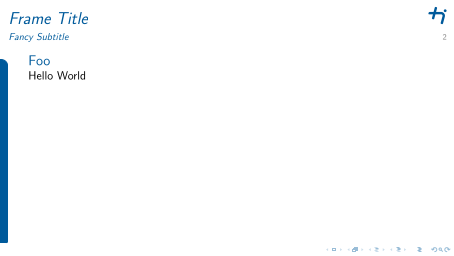

# LaTeX Beamer Theme Esplanade

An unofficial LaTeX Beamer theme that follows the [design manual](https://mythi.de/index.php?kc=20&pid=pov&mfid=167&otree=1) of [Technische Hochschule Ingolstadt](https://www.thi.de/).
It keeps changes to the standard Beamer layout to a minimum, so you can drop it into any existing presentation without touching your slides.
It is not a pixel-perfect copy of the [PowerPoint templates](https://mythi.de/index.php?kc=20&pid=pov&mfid=189&otree=1), but brings the same design language to LaTeX Beamer.

<kbd></kbd>

<kbd></kbd>

## Features

1. Everything in a single `.sty` file with no external file dependencies. Just put the `.sty` file next to your main `.tex` file and add `\usetheme{esplanade}` to your LaTeX document.
2. Follows the official [design manual](https://mythi.de/index.php?kc=20&pid=pov&mfid=167&otree=1) of Technische Hochschule Ingolstadt - same colors, shapes, and logos.
3. Stays close to the default LaTeX Beamer theme. Only the minimum necessary is changed, so you can add or remove this theme without editing any of your slides.
4. Switches for faculty-specific color variants and research institute logos.
5. Ready-made part-divider (`\partpage`) and section-overview slide (`\sectionpage`) templates for larger decks.

## Installation

1. Download the [`beamerthemeesplanade.sty`](./beamerthemeesplanade.sty) file from this repository.
2. Put it next to your main LaTeX Beamer file.
3. Add `\usetheme{esplanade}` to the preamble of your LaTeX code.
4. Compile and enjoy.

### Updating the Theme

1. Replace the old `beamerthemeesplanade.sty` file with [the new one from this repository](./beamerthemeesplanade.sty).
2. Compile and enjoy. No need to change anything else.

## Usage

### Configuration Options

#### Faculty color variants

```latex
\usetheme[faculty=<FACULTY>]{esplanade}
```
Where `<FACULTY>` is one of the following (case-sensitive):

- `generic`: (default) Normal THI blue
- `b`: Fakultät für Betriebswirtschaft
- `e`: Fakultät für Elektro- und Informationstechnik
- `i`: Fakultät für Informatik
- `iaw`: Institut für Akademische Weiterbildung *(legacy: same as `tcw`)*
- `m`: Fakultät für Maschinenbau
- `ni`: Fakultät für Nachhaltige Infrastruktur
- `tcw`: THI Campus für Weiterbildung
- `w`: Wirtschaftsingenieurwesen (WING)
- `zaf`: Zentrum für Angewandte Forschung

#### Institute logos

```latex
\usetheme[institute=<INSTITUTE>]{esplanade}
```
Where `<INSTITUTE>` is one of the following (case-sensitive):

- `none`: (default) No institute logo
- `car`: CARISSMA
- `aim`: AImotion Bavaria

#### Combining options

You can combine all options in a single `\usetheme` command, e.g.

```latex
\usetheme[faculty=i,institute=car]{esplanade}
```

for the computer science faculty color scheme with the CARISSMA institute logo.

### Supported Beamer Features

#### Beamer Package Options

All standard beamer options are supported, e.g. different font sizes (10pt, 11pt, 12pt), aspect ratios (169, 43), and the `t` option for top-alignment.

```latex
\documentclass[12pt,aspectratio=169,t]{beamer}
```

The [handout mode](./handout.tex) removing animations is also supported.

#### Standard Beamer Commands

These standard Beamer commands are actively rendered.

- `\date{<date>}` shown on the title and part-divider pages.
- `\institute{<institute>}` to override the default (`Technische Hochschule Ingolstadt`).
- `\titlegraphic{<graphic>}` is placed in the bottom-right corner of the title page.
- `\partpage` inserts a part-divider slide styled like the title page.
- `\sectionpage` inserts a section-overview TOC slide.

#### Example Usages

See [the example files in the `test/` directory](./test) for more usage examples.

## Contributing

Ideas, feedback, and bug reports are very welcome — [just open an issue](https://github.com/hutzelmann/BeamerThemeEsplanade/issues).
If you want to contribute code, please open an issue first, so we can discuss it before you send a pull request.

If you use this theme, please share it with others and leave a star on the repo.
This helps bring the LaTeX community at THI together and documents the extent to which LaTeX is used for professional presentations at THI.

## Technical Notes for Developers

The pdf source files of the logos are converted to tikz code with [Lovely-XPP/pdf2tikz](https://github.com/Lovely-XPP/pdf2tikz).
If you want to learn more about the layout of LaTeX Beamer, the [official Beamer class user guide](https://tug.ctan.org/macros/latex/contrib/beamer/doc/beameruserguide.pdf), the [Base implementation of the Beamer package](https://tug.ctan.org/macros/latex/contrib/beamer/base/), or the [beamer appearance cheat sheet](http://www.cpt.univ-mrs.fr/~masson/latex/Beamer-appearance-cheat-sheet.pdf) are great starting points.

## Copyright Remark

The logo and brand of [Technische Hochschule Ingolstadt](https://www.thi.de/) used in this theme are protected by copyright and their use is restricted. The CC0 license of this project explicitly excludes these logos and branding.
Digital versions of the logo are available on the [Wikipedia page about THI](https://de.wikipedia.org/wiki/Technische_Hochschule_Ingolstadt).
